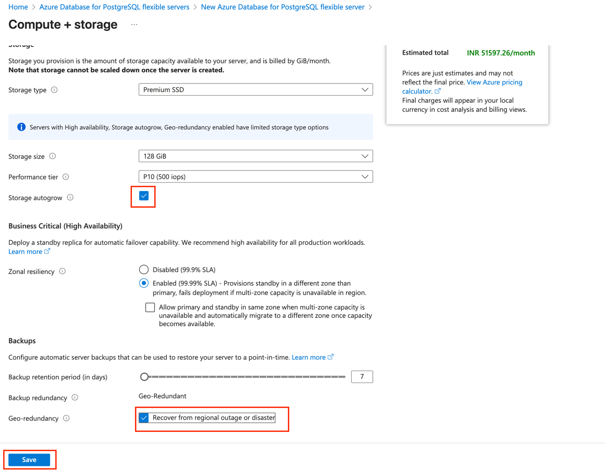
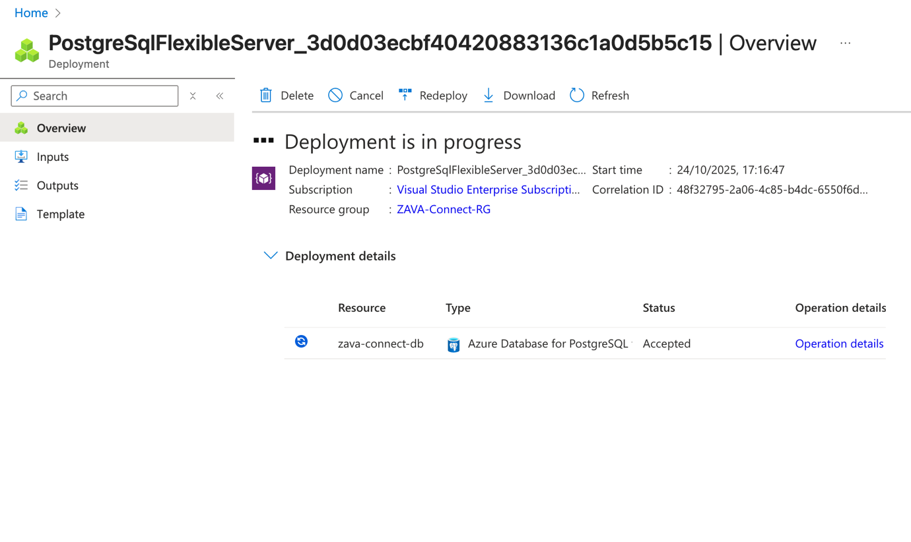
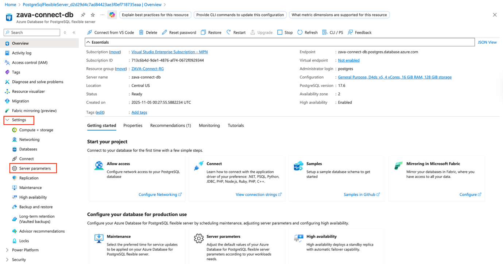
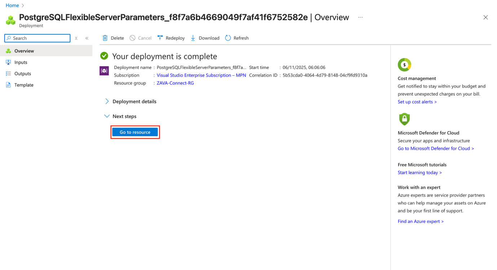
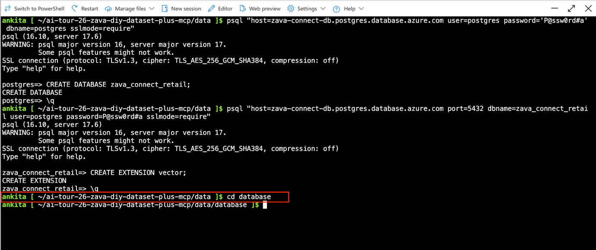
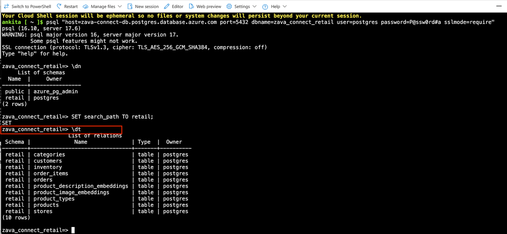
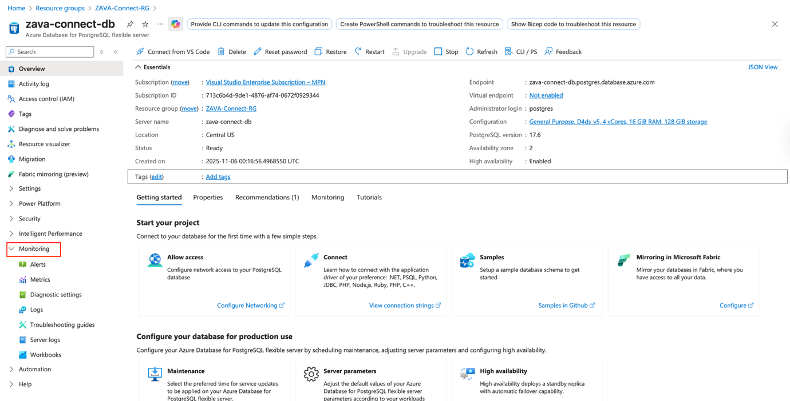
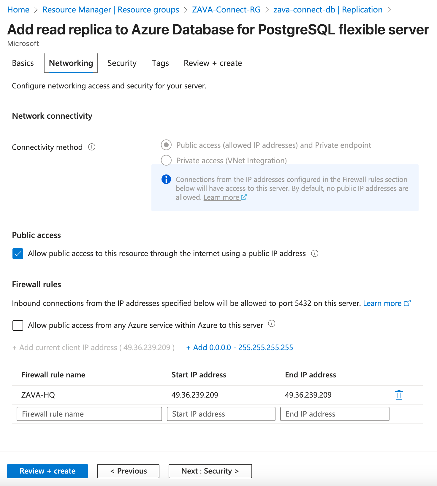
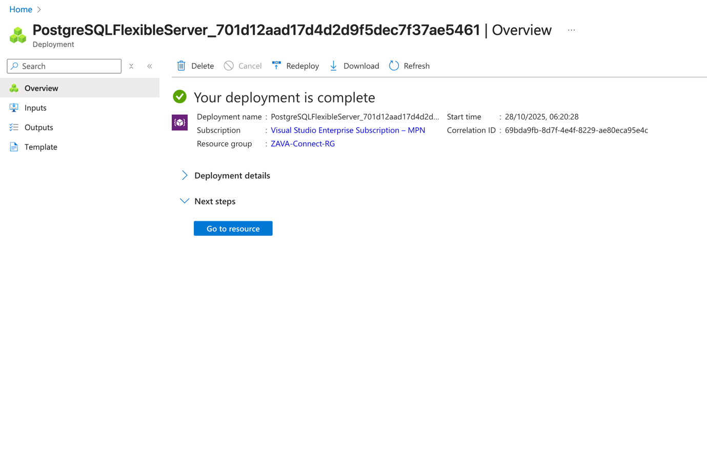
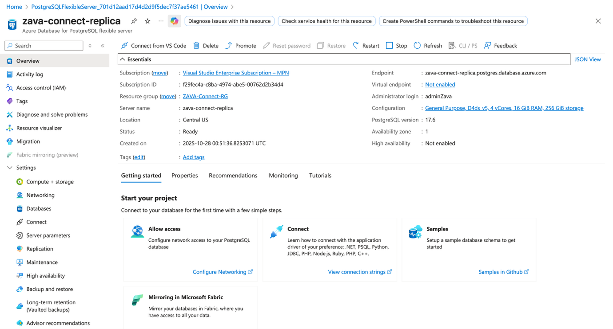

# Scenario

ZAVA DIY is a retail company with stores across Washington State and a
rapidly growing online e-commerce presence. Specializing in outdoor
equipment, home improvement tools, and DIY supplies, the company has
traditionally relied on manual spreadsheets and on-premises systems to
manage product, sales, and inventory data.

This outdated approach has resulted in data silos, delayed insights, and
frequent human errors — especially as online orders continue to surge.

To address these challenges, ZAVA’s leadership launched a cloud
modernization initiative to unify data, improve scalability, and enable
data-driven decisions across all channels. The team is developing a new
internal application — **ZAVA Connect**, an AI-powered platform designed
to automate data collection, unify insights, and deliver intelligent
recommendations for store operations and customer engagement.

Leading this initiative is **Carlos Vega**, the company’s **CTO**, who
oversees technology strategy and innovation. He’s supported by:

- **Kian Lambert – Database Administrator (DBA):** Responsible for
  provisioning, securing, and optimizing the database platform.

- **Elvia Aktins – Application Developer:** Focused on building app
  integrations and enabling AI-powered features within ZAVA Connect.

After evaluating multiple options, the team selects **Azure Database for
PostgreSQL – Flexible Server** as the foundation for ZAVA Connect. The
choice is driven by its **scalable performance**, **built-in security**,
**high availability**, and **AI-readiness** through **pgvector** and
Azure AI extensions — enabling advanced recommendation models and
semantic search.

**Your role in this lab:**  
Step into the role of **Kian Lambert (DBA)** to deploy, secure, and
optimize the Azure Database for PostgreSQL environment that powers ZAVA
Connect — turning ZAVA DIY’s data into actionable business insights.

# Objective

In this lab, you will:

- Provision and configure an Azure Database for PostgreSQL – Flexible
  Server to host ZAVA DIY’s retail data.

- Optimize compute and storage settings for scalability and performance.

- Implement high availability and automated backups to ensure business
  continuity.

- Secure the database environment using encryption, network rules, and
  access controls.

- Import the ZAVA DIY dataset into the PostgreSQL server.

- Run analytical queries on the dataset to extract business insights and
  validate the database configuration.

- Set up monitoring and performance insights to track database health
  and utilization.

## Exercise 1: Provisioning PostgreSQL Flexible Server

In this exercise, you’ll provision a PostgreSQL Flexible Server instance
in Azure to serve as the backend for ZAVA Connect. This includes
configuring compute, storage, and high availability options to ensure
performance and resilience.

### Task 1: Create a Resource Group

1.  Sign in to the Azure Portal.

2.  Go to the Resource groups, then select **+Create** to create a new
    resource.

3.  Enter the following details:

- Subscription: Keep the selected one as it is.

- Resource group name: +++ZAVA-Connect-RG+++

- Region: Central US

> Click on **Review + create**.
>
> 

4.  Click on **Create**.

Your resource group is created.

### Task 2: Provision PostgreSQL Flexible Server

1.  Go to the Home page and search **Azure Database for PostgreSQL
    Flexible Server** in the search bar.

2.  Click on **+Create**.

3.  Enter the following details.

- Subscription: Keep the default as it is.

- Resource group: Select ZAVA-Connect-RG

- Server name: Enter +++zava-connect-db+++

- Region: Select Central US

- Workload type: Select Production

Select the **configure server** in **Comput+storage**.

4.  The **Compute + storage** page opens. Now you can configure the
    following settings:

- Compute tier: General Purpose

- Storage autogrow: Select the checkbox

- Under Backups, select the Geo-redundancy checkbox.

Click on **Save** button to save updates.

5.  Under Authentication. Select **PostgreSQL authentication only**
    authentication method and enter the following login and password:

- Administrator login: Enter +++postgres+++

- Password: Enter +++P@ssw0rd#a+++

Select **Next:Networking \>**

6.  In the Networking tab, ensure that the **connectivity method** is
    **Public access(allowed IP addresses) and Private endpoint**, and
    allow public access to this resource through the internet using a
    public IP address.

7.  Under Firewall rules, enable “Allow public access from any Azure
    service within Azure to this server” and select +Add current client
    IP address. Then, rename the name of the firewall rule to
    +++ZAVA-HQ+++. Click on **Security.**

8.  In the Security tab, make sure that the Data encryption key is
    “Service-managed key” for both Primary and paired regions. Then
    click **Review + create**.

9.  Click on **Create.**

10. Wait for the deployment to be completed. It will take 5-10 mins to
    complete.

You have provisioned your PostgreSQL Flexible Server successfully.

## Exercise 2: Connect ZAVA Connect Database to PostgreSQL Flexible Server

In this exercise, you’ll enable the required PostgreSQL extensions and
load the **ZAVA DIY dataset** into your Azure Database for PostgreSQL
Flexible Server. You’ll also configure the connection parameters and
generate the ZAVA Connect retail database using the provided dataset
scripts.

### Task 1: Enable pgvector Extension

1.  Click Go to resource.

2.  Expand Settings from the left-hand side resource menu and select
    Server parameters.

3.  In the search bar, search for +++**azure.extensions+++** parameter.

4.  Search for the +++**VECTOR**+++ parameter and then select the VECTOR
    parameter. This will allow the pgvector extension.

5.  Select Save.

6.  Select Go to resource.

7.  Save the Server endpoint in Notepad for future use.

### Task 2: Clone the repo and create ZAVA Connect’s Database

1.  Open cloud shell.

2.  Clone the following repository:

+++git clone
https://github.com/microsoft/ai-tour-26-zava-diy-dataset-plus-mcp.git+++

3.  Navigate to the cloned repository

+++ cd ai-tour-26-zava-diy-dataset-plus-mcp+++

4.  Navigate to the \`data\` directory inside the repository:

+++cd data+++

5.  Install all the requirements using the following command:

+++ pip install --user -r requirements.txt+++

6.  Connect to the PostgreSQL flexible server.

> +++ psql "host=zava-connect-db.postgres.database.azure.com
> user=postgres password='P@ssw0rd#a' dbname=postgres
> sslmode=require"+++
>
> 

7.  Create a new database in the PostgreSQL Flexible server.

+++ CREATE DATABASE zava_connect_retail;+++

8.  Close the PostgreSQL server using the +++\q+++ command.

9.  Connect to the newly created zava_connect_retail database using the
    following command:

+++ psql "host=zava-connect-db.postgres.database.azure.com port=5432
dbname=zava_connect_retail user=postgres password=P@ssw0rd#a
sslmode=require"+++

10. Run the following query to create the pgvector extension in the
    target database.

+++ CREATE EXTENSION vector;+++

11. Close the database using the +++\q+++ command.

12. Change the current directory to the database directory.

+++cd database+++

13. Open generate_zava_postgres.py using +++ nano
    generate_zava_postgres.py+++.

14. In the nano generate_zava_postgres.py file, look for the following
    lines:

\# PostgreSQL connection configuration

POSTGRES_CONFIG = {

'host': 'db',

'port': 5432,

'user': 'postgres',

'password': 'P@ssw0rd!',

'database': 'zava'

}

Now replace the values of fields with the following values:

host: +++zava-connect-db.postgres.database.azure.com+++

port: +++5432+++

user: +++‘postgres’+++

password: +++‘P@ssw0rd#a’+++

database: +++‘zava_connect_retail’+++

15. In the same file, Press Ctrl + W -\> type 50000-\>press Enter. You
    will reach to the following function:

  
Now replace 50000 with +++1000+++. This will update the batch size,
which means you will only get the data of 1000 customers only.

Again, Press Ctrl + W -\> type 50000-\>press Enter. You will reach here:

Now replace 50000 with +++1000+++.

16. To save and exit from the nano generate_zava_postgres.py file press
    ctrl + O -\> press Enter -\>Ctrl + X.

17. Install the following package:

+++ pip install --user asyncpg+++

18. Run +++ python generate_zava_postgres.py+++ command. This command
    creates the ZAVA DIY PostgreSQL database and fills it with sample
    retail data. It sets up all tables, schemas, and data.

It will take 10-15 minutes to complete, and after completing, you will
get output like this:

> Now your PostgreSQL database contains all schemas and sample data for
> ZAVA DIY retail operations.

### Task 3: Querying and Exploring Azure PostgreSQL Data

1.  Connect to the target database.

+++ psql "host=zava-connect-db.postgres.database.azure.com port=5432
dbname=zava_connect_retail user=postgres password=P@ssw0rd#a
sslmode=require"+++

2.  See all the schemas.

+++\dn+++

3.  Switch to retail schema.

+++ SET search_path TO retail;+++

4.  List all the tables in the retail schema.

+++ \dt+++

5.  Find the first 10 customer records stored in the retail.customers
    table.

+++SELECT \* FROM retail.customers LIMIT 10;+++

6.  Let’s find the top 5 stores that generated the highest total revenue
    by summing up sales from all their orders.

SELECT

s.store_name,

ROUND(SUM(oi.quantity \* oi.unit_price), 2) AS total_revenue

FROM retail.orders o

JOIN retail.order_items oi ON o.order_id = oi.order_id

JOIN retail.stores s ON o.store_id = s.store_id

GROUP BY s.store_name

ORDER BY total_revenue DESC

LIMIT 5;

7.  Now retrieves the **top 5 stores** with the **highest total
    revenue**, calculated by multiplying product quantity and unit price
    from all their sales.

SELECT

c.category_name,

SUM(oi.quantity) AS total_units_sold

FROM retail.order_items oi

JOIN retail.products p ON oi.product_id = p.product_id

JOIN retail.categories c ON p.category_id = c.category_id

GROUP BY c.category_name

ORDER BY total_units_sold DESC

LIMIT 5;

Now close the connection using \q.

You have successfully explored and verified the ZAVA Connect database
hosted on Azure Database for PostgreSQL-Flexible Server.

## Exercise 3: Verify Secure Connectivity 

In this exercise, you’ll verify that your **Azure Database for
PostgreSQL – Flexible Server** is configured securely. You’ll check
encryption settings, firewall rules, and secure access policies to
ensure that only authorized users and trusted services can connect to
the database.

### Task 1: Validate Network Access Controls

1.  Minimize the Azure CLI window but keep it open.

2.  In the **Azure Portal**, navigate to your **Azure Database for
    PostgreSQL Flexible Server** resource.

3.  From the left-hand menu, select **Networking** under **Settings**.

4.  Review the **Connectivity method**:

- Ensure it is set to **Public access (allowed IP addresses)**.

- For this lab, public access is enabled, but only from specific trusted
  IPs.

> 

5.  Under **Firewall rules**, confirm that:

- “Allow public access from any Azure service within Azure to this
  server” is **enabled**.

- Only the rule **ZAVA-HQ** (your current client IP) appears — this
  prevents open access from the internet.

> 

6.  Try connecting again from Cloud Shell using the psql command:

> +++psql "host=zava-connect-db.postgres.database.azure.com port=5432
> dbname=zava_connect_retail user=postgres password=P@ssw0rd#a
> sslmode=require"+++
>
> 

7.  From the Azure portal, temporarily remove the **ZAVA-HQ** firewall
    rule to check and disable: “Allow public access from any Azure
    service within Azure”. Click Save.

> 

8.  Wait 1–2 minutes for changes to apply.

9.  Open Azure CLI and attempt to reconnect using the following psql
    command:

> +++psql "host=zava-connect-db.postgres.database.azure.com port=5432
> dbname=zava_connect_retail user=postgres password=P@ssw0rd#a
> sslmode=require"+++
>
> You should receive an error such as:
>
> 
>
> This confirms that the firewall and IP restrictions are working
> correctly.

10. Navigate back to the Azure portal of PostgreSQL flexible server and
    re-add the current client IP rule (**ZAVA-HQ**) and enable “Allow
    public access from any Azure service within Azure” to restore
    access. Click Save.

> 
>
> Now we it is working fine.
>
> 

### Task 2: Verify Encryption Settings

1.  In the Azure portal, navigate to the PostgreSQL Flexible Server, go
    to **Security** under **Settings**.

2.  Under **Data encryption**, confirm:

- The **Primary region key** is **Service-managed key**.

- The **Geo-redundant key** (paired region) is also **Service-managed
  key**.

> This ensures that **Transparent Data Encryption (TDE)** is applied
> automatically to protect your data at rest.

3.  To verify encryption in transit, note that your psql connection
    string includes: **sslmode=require.** This enforces SSL encryption,
    protecting data during transmission between the client and the
    database.

4.  Run this query in your connected psql session:

+++ SHOW ssl;+++

You should see:

This confirms SSL encryption is active for your connection.

> **Note:** Azure Database for PostgreSQL enforces SSL connections by
> default. Even without explicitly specifying sslmode=require,
> connections are automatically encrypted with TLS.

## Exercise 4: Monitoring Performance in Azure Database for PostgreSQL – Flexible Server

In this exercise, you’ll learn how to monitor the performance of your
Azure Database for PostgreSQL – Flexible Server. You’ll generate a
sample workload and observe key performance metrics such as CPU, memory,
and storage utilization in the Azure Portal.

### Task 1: Generate Query Workload

1.  Run the following multiple times to create a noticeable load on the
    server.

-- 1. Total revenue by store

SELECT s.store_name, SUM(oi.quantity \* oi.unit_price) AS total_revenue

FROM retail.orders o

JOIN retail.order_items oi ON o.order_id = oi.order_id

JOIN retail.stores s ON o.store_id = s.store_id

GROUP BY s.store_name

ORDER BY total_revenue DESC

LIMIT 5;

-- 2. Top 10 best-selling products

SELECT p.product_name, SUM(oi.quantity) AS total_sold

FROM retail.order_items oi

JOIN retail.products p ON oi.product_id = p.product_id

GROUP BY p.product_name

ORDER BY total_sold DESC

LIMIT 10;

-- 3. Daily order volume

SELECT order_date, COUNT(\*) AS total_orders

FROM retail.orders

GROUP BY order_date

ORDER BY total_orders DESC

LIMIT 10;

### Task 2: Monitor Performance Metrics

1.  Minimize the Azure CLI window. In the Azure Portal, go to PostgreSQL
    Flexible Server.

2.  Expand Monitoring from the left-hand side menu and select Metrics.

3.  In the chart, select **CPU percent** under Metric.

4.  Set the local time to the last hour so that we can see the metrics
    for the latest executed queries. And select **Apply**.

5.  This metric displays the percentage of CPU resources currently being
    utilized by your PostgreSQL server. Use this chart to identify
    periods of high query processing or when your workload is consuming
    more compute power than expected

6.  Click on +New Chart.

7.  Add another chart and select **Memory percent** under **Metric**.

8.  This metric shows how much of the server’s available memory is being
    used. Consistently high memory usage can indicate that queries are
    performing large sorts, joins, or caching operations, and may
    benefit from scaling or query optimization.

9.  Again, click on +New Chart.

10. In the new chart, from the Metric dropdown, select **Storage used**.

11. This metric shows how much of your allocated database storage is
    currently being utilized. You can use it to monitor data growth over
    time or detect sudden increases caused by large inserts or index
    creation.

12. Run your SQL queries again and watch for metric spikes in real time.

## Exercise 5: Ensure High Availability & Backups

In this exercise, you’ll configure and verify high availability and
backup settings for **ZAVA Connect’s Azure Database for PostgreSQL –
Flexible Server**. These settings ensure that your database remains
resilient against outages and data loss through redundancy, geo-backups,
and replication.

### Task 1: Verify High Availability Configuration

1.  In the **Azure Portal**, navigate to your **zava-connect-db**
    PostgreSQL Flexible Server.

2.  Select Setting from the menu and then select High availability.

3.  Confirm that **Zonal resiliency** is **enabled**. This ensures that
    your database is deployed across availability zones for fault
    tolerance.

**Note:** If it’s not enabled, note that zonal configuration can only be
set during initial provisioning.

### Task 2: Validate Backup Configuration

1.  From the same menu, select **Backup and restore**.

2.  Confirm that Backup redundancy is set to Geo-redundant and backups
    are taking automatically.

Geo-redundant backups store copies in a paired region, ensuring business
continuity even in regional outages.

### Task 3: Configure Read Replica

1.  In the left-hand menu, select **Replication**. Click **+Create
    Replica**.

2.  Enter the following details:

- Resource group: Select ZAVA-Connect-RG

- Server name: Enter +++zava-connect-replica+++

- Location: Central US

> Click Next: Networking\>
>
> 

3.  Keep all the default settings. Click Review+create.

4.  Click Create.

5.  Wait for a few minutes to complete the deployment. It will take 5-10
    mins.

6.  After completing the deployment, click Go to resource.

7.  Navigate back to the Replication window of your primary server. You
    should now see the **zava-connect-replica** listed as an active read
    replica.

**Replication helps improve performance and availability** by offloading
read workloads to replica servers and ensuring rapid failover in case
the primary database becomes unavailable.

## Summary

In this lab, you built and secured the data foundation for **ZAVA
Connect** using **Azure Database for PostgreSQL – Flexible Server**. You
provisioned the server, enabled pgvector, and loaded the ZAVA DIY
dataset to support AI-driven insights. You then verified security,
monitored performance, and configured high availability and backups for
resilience. By the end, ZAVA DIY achieved a modern, secure, and scalable
data platform ready to power smarter retail operations and future
innovation.
