# Scenario

ZAVA Express Logistics, a branch of ZAVA DIY, manages regional freight
shipping, fleet operations, warehouse inventory, and last-mile delivery.
Traditionally, the branch relied on on-premises systems and manual
processes to coordinate deliveries, track vehicles, and manage stock,
which led to frequent data silos, operational inefficiencies, and
delayed insights — especially during peak periods. To address these
challenges, ZAVA’s leadership launched a cloud modernization initiative
aimed at centralizing operations, streamlining workflows, and enabling
real-time decision-making across the branch. Under the guidance of
Carlos Vega, CTO, the team conducted a thorough assessment of the
branch’s on-premises environment, identifying over 50 operational
systems and selecting one representative workload for a pilot migration.
This workload, a web-based branch management system running on Red Hat
Enterprise Linux (RHEL) servers and connected to a PostgreSQL database,
was chosen because it exemplified the common components found across
other branch systems while remaining manageable for testing the
migration plan.

The branch migration project leverages Azure Database for PostgreSQL –
Flexible Server, chosen for its scalable performance, built-in security,
high availability, and AI-readiness through pgvector and Azure AI
extensions — capabilities that will support predictive route
optimization, vehicle maintenance insights, and intelligent delivery
recommendations in the future. Carlos Vega assigned this task to Marcus
Dwyer, the newly introduced cloud migration specialist, who is
responsible for executing the migration, coordinating cutover,
validating data integrity, and minimizing downtime.

Your role in this lab:

Step into the role of **Marcus Dwyer (DBA)** to migrate the on-premises
branch database to Azure Database for PostgreSQL Flexible Server, a
fully managed cloud database service.

# Objective

In this lab you will learn:

- Simulate an on-premises branch environment for ZAVA Express Logistics
  in Azure.

- Deploy and configure a web-based branch management application on
  Linux virtual machines.

- Connect the application to an internal PostgreSQL database and verify
  functionality.

- Provision an Azure Database for PostgreSQL Flexible Server as a
  managed cloud database.

- Migrate the on-premises PostgreSQL database to the Azure Flexible
  Server securely and efficiently.

- Validate the database migration, ensuring data integrity, performance,
  and availability.

- Understand the end-to-end process of migrating representative
  workloads from on-premises to Azure in a cloud modernization scenario.

# Exercise 1 - Lab Setup

In this exercise, you will deploy a simulated on-premises environment
for ZAVA Express Logistics using a custom ARM template. They will
configure Linux-based virtual machines and set up a web-based branch
management application to connect to an internal PostgreSQL database.
Participants will connect to the VMs securely using Bastion, install
required utilities, clone configuration scripts, and validate the
application, ensuring the on-premises workload is operational and
accessible.

## Task 1 – Create resources

In this task, you will leverage a custom Azure Resource Manager (ARM)
template to deploy the Azure resources and create a simulated
on-premises environment for ZAVA Express Logistics.

1.  Open a browser and navigate to +++https://portal.azure.com/+++. Now,
    sign in with your account.

2.  Open a new tab in the browser, and navigate to the following link to
    get the ARM template: 

> +++https://github.com/technofocus-pte/MigrateLinuxworkloads/tree/main/resources/deployment+++

3.  Select **Deploy to Azure**. This will open a new browser tab to the
    Azure Portal for custom deployments.

4.  Fill in the required ARM template parameters.

    - **Subscription:** Use the default one

    - **Resource group:** Select **ResourceGroup1**

    - **Region:** UK South

    - **Resource Name Base:** Enter +++ZavaWeb +++

    - **Password:** Enter +++pass@dmIn234+++

Select **Review + create.**

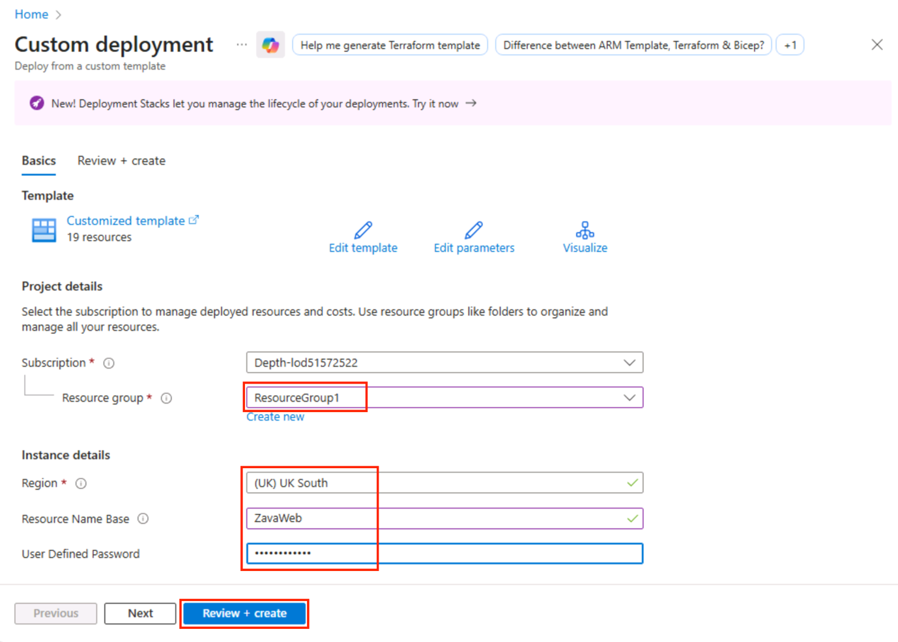

5.  Click on the **Create** button to start deployment.

> 

6.  The deployment is now underway. On average, this process can take
    10-20 minutes to complete.

> 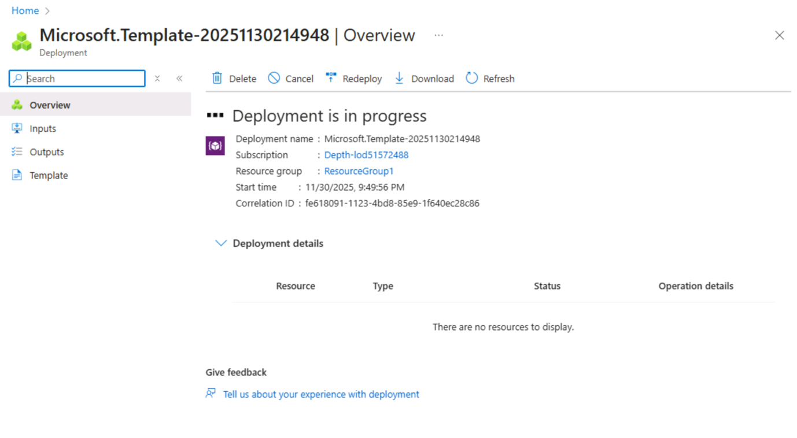

**Note**: While automation can make things simpler and repeatable,
sometimes it can fail. If at any time during the ARM template deployment
there is a failure, review the failure, delete the Resource Group, and
try the ARM template again. Or review the failures and adjust for errors
as appropriate.

7.  Once the ARM template is deployed successfully, the status will
    change to complete. Click on **Go to resource group** to open the
    resource group.

> 

## Task 02 - Configure on-premises web application

In this task, you will configure the web application hosted on the
simulated on-premises APP virtual machine that was provisioned by the
ARM Template deployment.

1.  Select the **On-premises Workload VM** named similar
    to **ZavaWeb-onprem-workload-vm**.

2.  In the **Overview** page, go to **Properties**, and under the
    **Networking** section, locate the **Private IP Address** of the VM
    and copy it into Notepad.

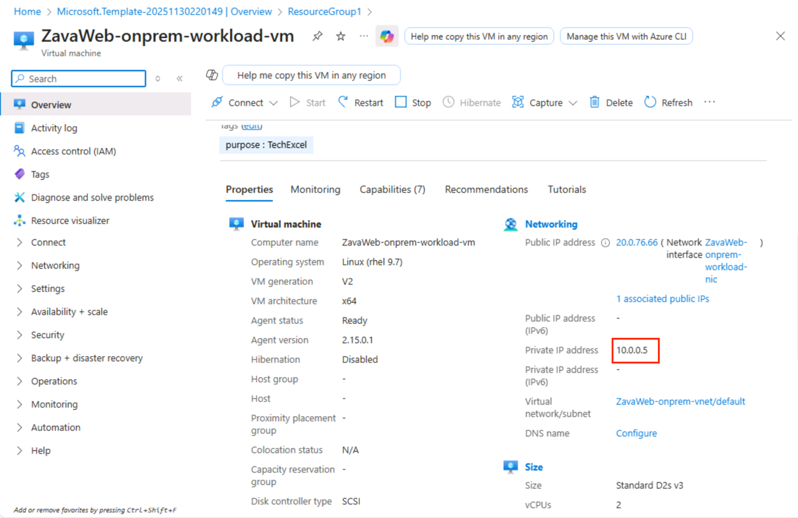

**Note:** You will need this IP address to configure the web application
to use the database workload server.

3.  Navigate back to the **ResourceGroup1**, then select
    the **On-premises APP VM** named similar
    to **ZavaWeb-onprem-app-vm**.

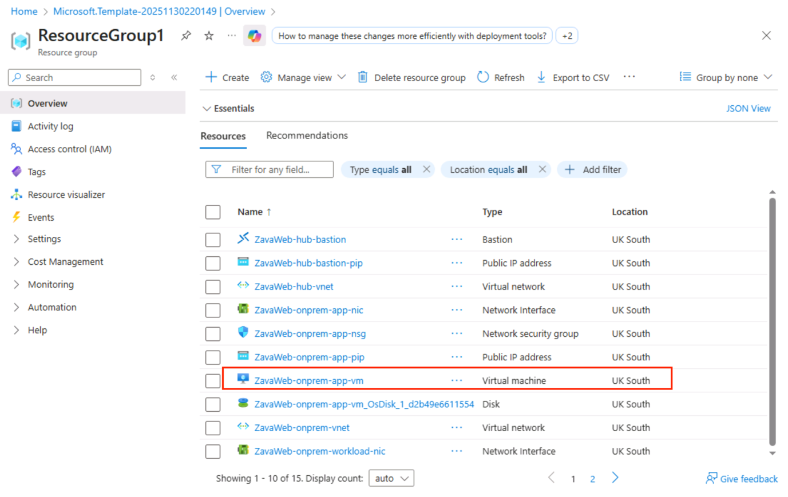

4.  Search for +++**Bastion**+++ in the left-hand menu and then select
    **Bastion**. We will use a bastion host as the method to connect to
    our VMs, as this is a more secure method.

5.  Within the **Bastion** page, enter the following details:

- **Authentication Type:** VM Password

- **Username:** Enter +++demouser+++

- **VM Password:** Enter +++pass@dmIn234+++

Then click on the **Connect** button to connect with Bastion.

> **Note**: You may need to **allow pop-ups** if they are blocked in
> your browser.

6.  When connected to the VM via the Bastion host, you will get a screen
    like this:

**Note**: If you see a pop-up stating “See test and images copied to the
clipboard”. Click **Allow**.

7.  Once connected via Bastion, run the following command to install the
    git utility on the server by using the clipboard within the
    session:   
     

8.  Click the arrows, which will expand the window

9.  Copy the command below and paste it into the clipboard. 

> +++sudo yum install git  -y+++ 

10. Now, right-click on the window, which will paste the command and run
    it. 

  
Note: Similarly you can run all these commands in the Bastion.

11. Enter the following command to clone the remote git repository
    holding a script which will configure the web app on the application
    server.

+++sudo git clone
https://github.com/technofocus-pte/TechExcel-Migrate-Linux-workloads.git+++

12. You can now run the configuration script by using the following
    command:

++++sudo bash
TechExcel-Migrate-Linux-workloads/resources/deployment/onprem/APP-workload-install.sh+++

You will get a status message of  “The script was successful”.

13. Execute the following command to open the **orders.php** file for
    the web application in a text editor. The application needs to be
    configured to connect to the **Azure Database for PostgreSQL
    Flexible Server** database.

+++sudo nano /var/www/html/orders.php+++

14. Use the **down arrow** key to scroll down in the order.php file
    until you locate $host, $port, $dbname, $user, and $password.

15. Check the host IP address and configure it to match the **Private IP
    Address** of the **ZavaWeb-onprem-workload-vm** instance. If the
    host IP is already correct, skip to steps 13 and 14. And press
    **Ctrl+X** to exit the editor.

16. If the host IP is not the same, then replace it with the **Private
    IP Address** of the **ZavaWeb-onprem-workload-vm** instance that was
    copied in step 2. Then press **Ctrl+X**.

17. Press +++**Y**+++ to save the modified buffer and then press
    **Enter** to write the changes in the file.

18. You are now exited from the orders.php file with the changes saved.

You have now learnt some basic Linux commands and configured the web
application to use the database on an internal network rather than
across the internet.

## Task 03 - Validate on-premises web application

In this task, you will validate the web application hosted on the
simulated on-premises APP virtual machine that was provisioned by the
ARM Template deployment.

1.  Navigate back to Azure Portal, open the ResourceGroup1, then select
    the **On-premises APP VM** named similar to ZavaWeb-onprem-app-vm*.*

2.  In the **Overview** window, locate the VM’s **Public IP Address**
    and copy it into Notepad.

3.  Open a new browser window, then navigate to the
    following **http:// URL** to access the simulated on-premises web
    application provisioned for this lab. Be sure to replace
    the **\<ip-address\>** placeholder with the Public IP Address for
    the VM. For example: http://172.206.126.43

+++http://\<ip-address\>+++

**Note:** You should get the Red Hat Enterprise Linux Test Page 

4.  When the web page loads, enter the following at the end of the URL.
    For example: "http://172.206.126.43/orders.php"

+++http://\<ip-address\>/orders.php+++

Now, things are ready for you to go through the lab.

# Exercise 2 - Migrate a PostgreSQL Database

In this exercise, you will migrate the on-premises PostgreSQL database
for the web application workload to Azure. The migration service in
Azure Database for PostgreSQL will be used to perform the database
migration from the PostgreSQL server on-premises to the Azure Database
for PostgreSQL service.

## Task 01 - Create Azure Database for PostgreSQL

In this task, you will create a new PostgreSQL database that will be the
target for the database migration.

1.  Navigate back to the Azure portal-\>Home-\>Create a resource.

> 

2.  In the **Marketplace** window, search for +++**PostgreSQL
    flexible**+++, then select **Azure Database for PostgreSQL Flexible
    Server** from the search results.

> 

3.  Click **Create** and then select **Azure Database for PostgreSQL
    Flexible Server.**

> 

4.  On the **New Azure Database for PostgreSQL** **Flexible
    Server** pane, select the following values:

    1.  **Subscription:** Keep default

    2.  **Resource group:** Select **ResourceGroup1**

    3.  **Server name:** Enter +++**zavaweb-dbXXXXX** +++

    4.  **Region:** UK South

    5.  **PostgreSQL version:** Keep the default, as it always selects
        the latest version

    6.  **Workload type:** Select **Dev/Test**

> 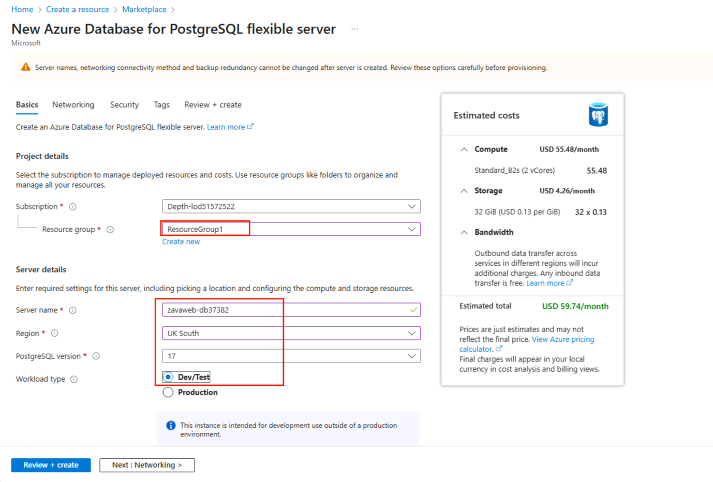

5.  Under **Compute + storage,** click **Configure server**.

6.  On the Compute + storage window, under the **compute** section,
    choose the following:

    1.  **Compute tier:** General Purpose (2-64 vCores) - Balanced
        configuration for most common workloads\*\*

    2.  **Compute Size:** Standard_D4ds_v5 (4 vCores, 16GiB memory, 6400
        max iops)

> 

7.  Under the **High availability** section, choose **Disabled (99.9%
    SLA)** and then click **Save.**

8.  On the **New Azure Database for PostgreSQL** **Flexible Server**
    window, under the **Authentication** section, enter the following
    details:

    1.  **Authentication method**: Choose **PostgreSQL authentication
        only**

    2.  **Admin username**: Enter +++pgadmin+++

    3.   **Password**: Enter +++passadmin3@2+++

> Select **Next: Networking**
>
> 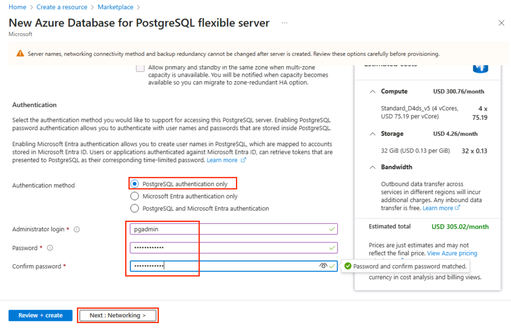

9.  In the **Networking** tab, under **Public access**, clear the
    checkbox to disable public access.

> 

10. Under **Private endpoint** section, select **Create private
    endpoint.**

> 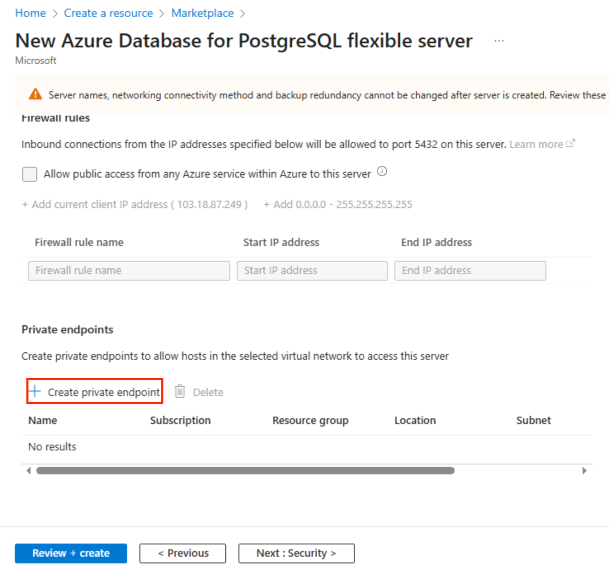

11. On the **Create private endpoint** window, enter the following
    details:

    1.  **Subscription:** Keep default

    2.  **Resource group:** ResourceGroup1

    3.  **Location**: UK South

    4.  **Name:** Enter +++post-priv-endpoint+++

    5.  **Virtual network:** Select
        **ZavaWeb.Id-spoke-vnet(ResourceGroup1)**

    6.  **Subnet**: Select **default**(10.2.0.0/24)

    7.  **Integrate with privet DNS zone:** Select No (You will use an
        IP address rather than a DNS entry when connecting.)

    8.  Click **OK**

> 

12. Select **Review + create**.

13. Select **Create** to provision the service.

> 

14. Click **Create server without firewall rules** - as you will use the
    private endpoint for access.

> 

15. Wait for deployment to complete; it will take 5-10 mins. Once
    provisioning has finished, click on **Go to resource**.

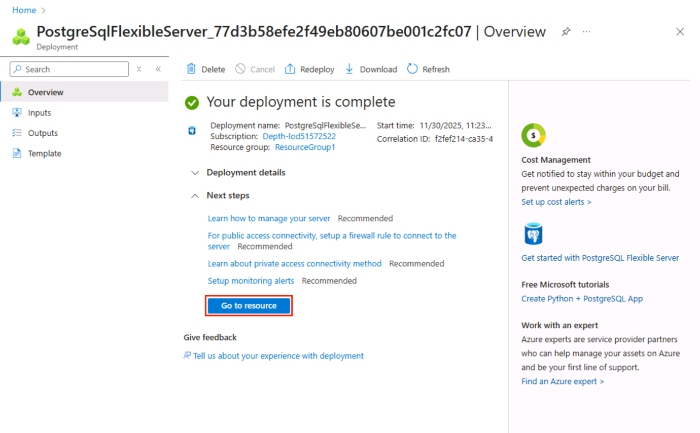

16. In the Overview tab of the **Azure Database for PostgreSQL flexible
    server,**  copy and save the **Server name** in Notepad for use
    later.

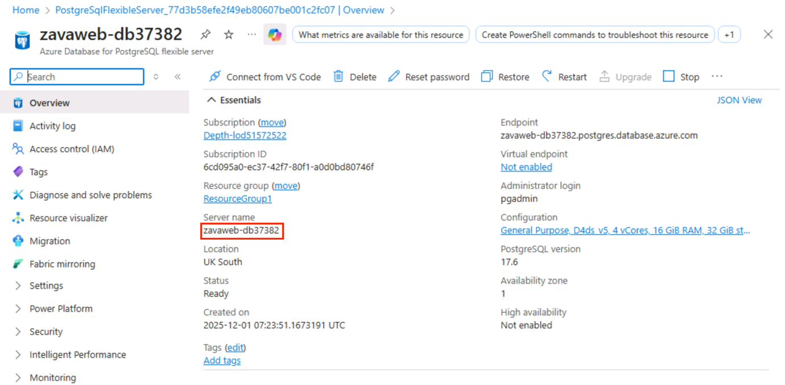

## Task 02 - Migrate your database to Azure Database for PostgreSQL flexible server

In this task, you will set up a migration project and configure the
Source and Target connections. You will then execute and monitor a
migration of your on-premises PostgreSQL database into Azure Database
for PostgreSQL - flexible server.

1.  Select **Migration** from the menu on the left of the flexible
    server blade.

> 

2.  Click on the **+ Create**.

> 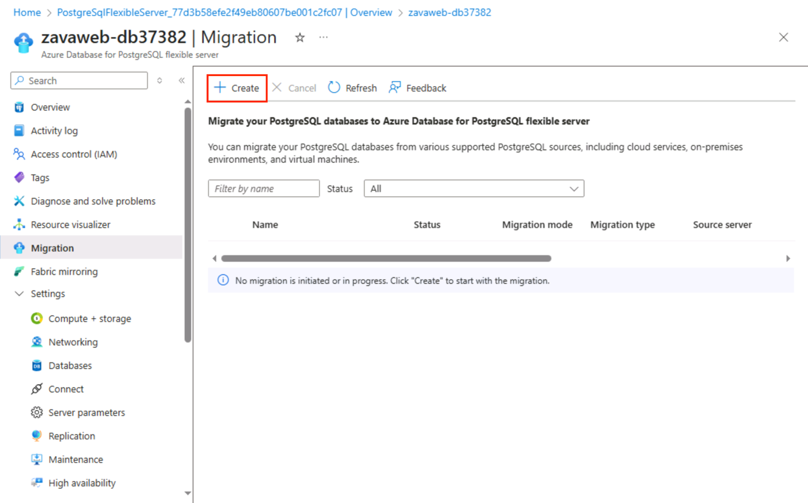
>
> **Note**: If the **+ Create** option is unavailable,
> select **Compute + storage** and change the compute tier to
> either **General Purpose** or **Memory Optimized** and try to create
> the Migration process again. After the Migration is successful, you
> can change the compute tier back to **Burstable**.

3.  On the **Setup** tab, enter each field as follows:

    1.  **Migration name:** +++Migration-Zava-northwind+++

    2.  **Source server type:** On-premise Server.

    3.  **Migration option:** Validate and Migrate.

    4.  **Migration option:** Offline

    5.  Select **Next: Runtime server \>**

> 
>
> **Note:** The Runtime server \> button might be enabled after 20-30
> mins.

4.  We will **not** use a Runtime Server, so just select **Next: Source
    server \>**.

> 

5.  On the **Source server** tab, enter each field as follows:

    1.  Server name: The public IP address of the
        “ZavaWeb-onprem-workload-vm”.

    2.  **Port:** 5432

    3.  **Server admin login name:** rootuser(the VM has been setup with
        an admin user called rootuser)

    4.  **Password:** Enter+++123rootpass456+++

    5.  **SSL mode:** Prefer.

    6.  Click on the **Connect to source** option to validate the
        connectivity details provided.

    7.  Click on the **Next: Target server\>** button to progress.

> 

6.  The connectivity details should be automatically completed for the
    target server we are migrating to.

    1.  In the password field -  Enter +++passadmin3@2+++

    2.  Click on the **Connect to target** option to validate the
        connectivity details provided.

    3.  Click on the **Next: Databases to validate or migrate
        \>** button to progress.

> 

7.  On the **Databases to validate or migrate** tab, select the
    **northwind** database because you want to migrate to the flexible
    server. Then click on the **Next : Summary \>** button to progress
    and review the data provided.

> 

8.  On the **Summary** tab, review the information and then click
    the **Start Validation and Migration** button to start the migration
    to the flexible server.

> 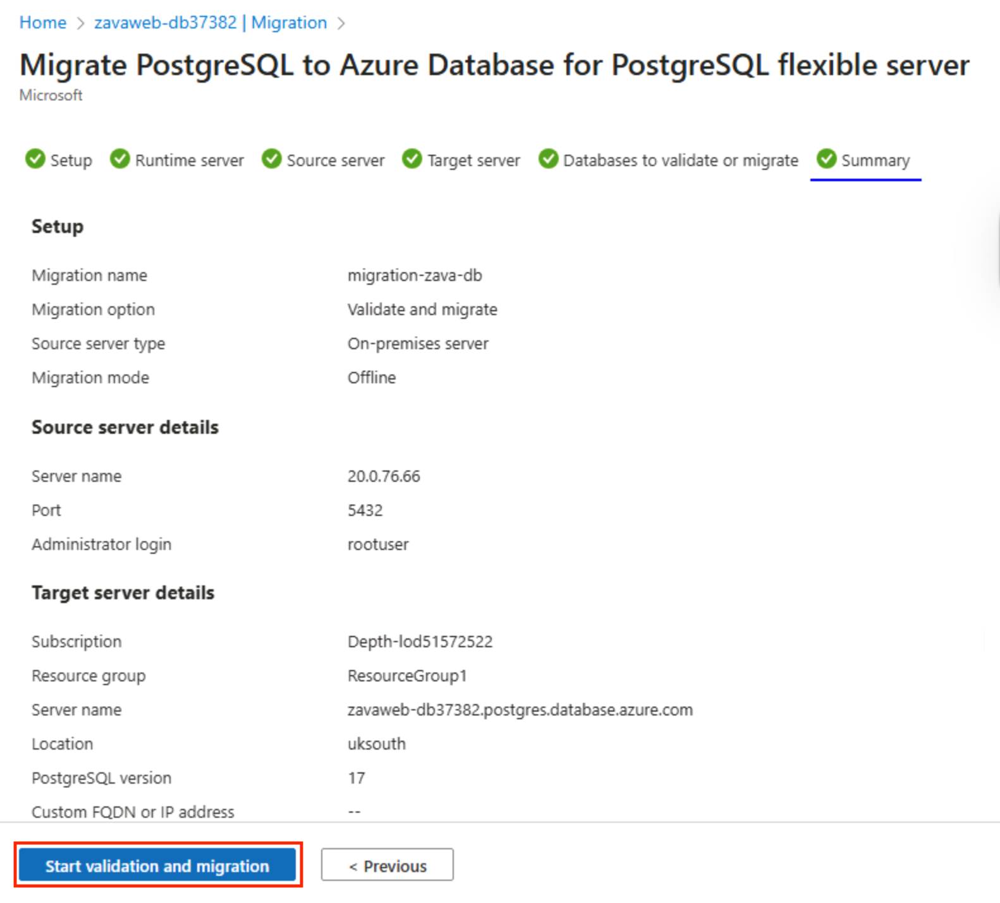

9.  On the **Migration** tab, you can monitor the migration progress by
    using the **Refresh** button in the top menu to view the progress
    through the validation and migration process.

> 

10. By clicking on the **Migration-northwind** activity, you can view
    detailed information about the migration activity’s progress.

During this migration, a database will be automatically created in the
PostgreSQL Flexible Server, and the data will be migrated into it.

# Summary

In this lab, you **simulated** an on-premises branch environment for
ZAVA Express Logistics by deploying Linux VMs and configuring a
web-based branch management application connected to a PostgreSQL
database. You **provisioned** an Azure Database for PostgreSQL Flexible
Server and **migrated** the on-premises database to Azure. The lab
**covered** validating the migration, ensuring data integrity, and
optimizing performance. You **gained** hands-on experience in deploying,
configuring, and migrating workloads from on-premises to Azure,
demonstrating a real-world cloud modernization process.
