# Lab 3: Migrating ZAVA’s Oracle ERP Database to Azure Database for PostgreSQL – Flexible Server (Heterogeneous Migration) 

## Scenario 
ZAVA DIY, a leading home improvement and retail chain, has recently expanded its e-commerce operations, managing nationwide online orders, customer accounts, and warehouse inventory. The ZAVA E-Commerce Division relies on a legacy Oracle ERP system hosted on-premises to track orders, stock movements, and generate reports. With growing transaction volumes and seasonal spikes, the on-premises system has become a bottleneck, causing delayed order processing and inconsistent inventory data. 

To address these challenges, ZAVA’s executive team launched a cloud modernization initiative aimed at centralizing the ERP database, enabling real-time insights, and improving scalability. Carlos Vega, CTO, identified the Order Management Module of the Oracle ERP as the ideal candidate for a pilot migration. This module handles transactional data for online orders, inventory updates, and customer interactions, representing the complexity of the larger ERP system. 

ZAVA’s target platform is Azure Database for PostgreSQL – Flexible Server, chosen for its high availability, scalable performance, and AI capabilities through pgvector and Azure AI extensions. These features will eventually support predictive stock replenishment, intelligent order routing, and customer personalization. 

Carlos Vega assigned Marcus Dwyer, the Cloud Migration Specialist, to lead the migration using Ora2Pg, a tool designed for heterogeneous migrations from Oracle to PostgreSQL. Marcus’s responsibilities include: 

- Assessing the existing Oracle database and workloads. 

- Configuring Ora2Pg to analyze schemas, convert data types, and generate PostgreSQL-compatible SQL scripts. 

- Migrating the Order Management Module to Azure Database for PostgreSQL – Flexible Server. 

- Validating data integrity, ensuring referential constraints are preserved, and testing end-to-end workflows. 

**Your role in this lab:** 

- Step into the role of Marcus Dwyer (Cloud Migration Specialist) to migrate ZAVA DIY’s on-premises Oracle ERP Order Management Module to Azure Database for PostgreSQL Flexible Server using Ora2Pg. You will: 

- Configure Ora2Pg for schema extraction and conversion. 

- Generate and review PostgreSQL-compatible SQL scripts. 

- Load data into Azure Database for PostgreSQL – Flexible Server. 

- Validate data consistency, run sample queries, and ensure that critical e-commerce workflows continue to function seamlessly in the cloud.
  
## Task 1: Provision PostgreSQL Flexible Server

1.  Open a web browser and sign in to the Azure
    portal at +++https://portal.azure.com+++ using the following cloud
    slice credentials.

- Username - +++@lab.CloudPortalCredential(User1).Username+++

- Password - <+++@lab.CloudPortalCredential(User1).Password>+++

> 

2.  In the search bar, enter +++PostgreSQL Flexible Server+++ and then
    select **Azure Database for PostgreSQL flexible servers**.

3.  Click +Create.

4.  Now enter the following details:

Resource group: Select ResourceGroup1

Server name: Enter +++ postgrenewserver+++

Region: Select “Central US”

PostgreSQL Version: 16

Workload type: Dev/Test

5.  Under Authentication, select **PostgreSQL authentication only** and
    then enter the following credential values:

- Username: +++pgAdmin+++

- Password: +++p$ssw0rd1289+++

Select **Networking**

6.  In the networking tab, please ensure that connectivity method is set
    to Public access and “Allow public access to this resource through
    the internet using a public IP address” is enabled.

7.  Under the Firewall section, enable “Allow public access from any
    Azure service within Azure to this server” and click +Add current
    client IP address. Then it will add a firewall rule for your current
    IP. Click **Review + Create**.

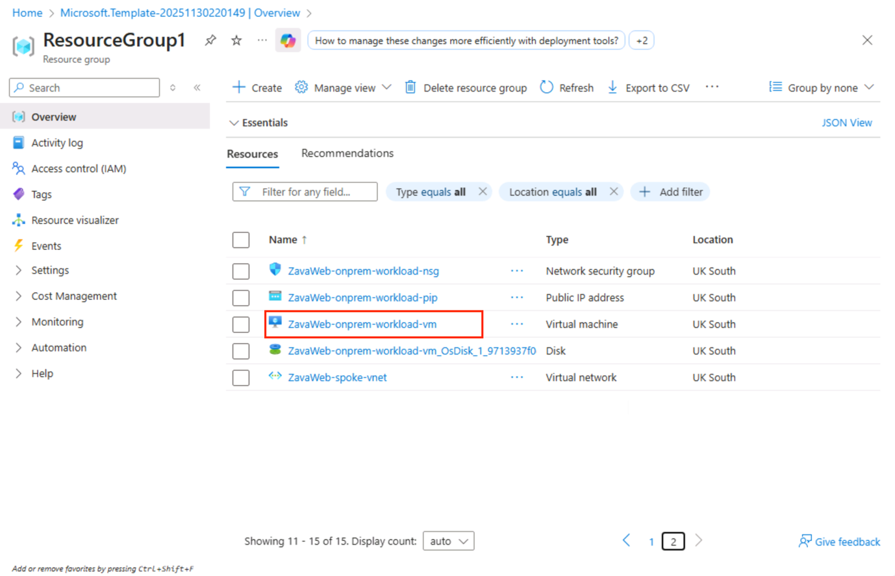

8.  Click **Create**.

9.  Wait for 10-15 mins to complete the deployment.

## Task 2: Create a virtual machine

1.  Navigate to the Home page of the Azure portal. Select **Virtual
    machines** from the Azure services.

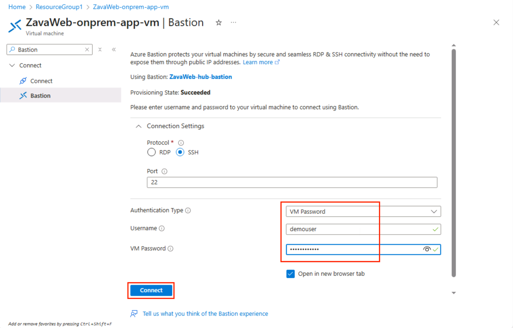

2.  Click **+Create**.

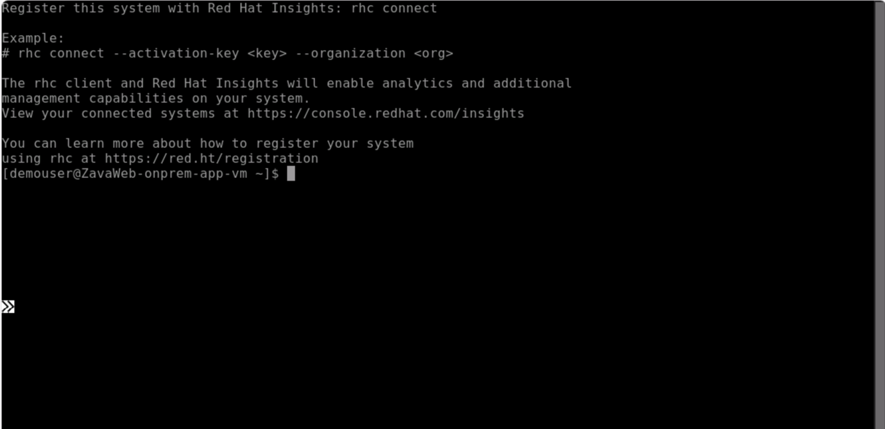

3.  Select **Virtual Machine**.

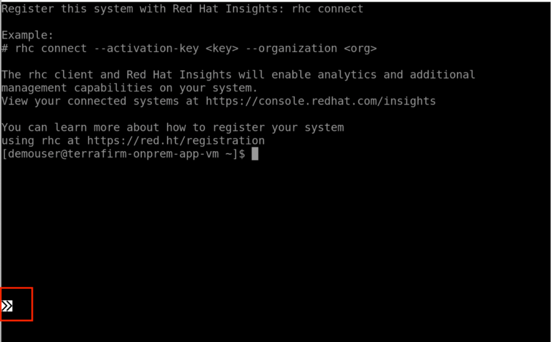

4.  In the Create a virtual machine window, enter the following details:

Subscription: Keep the default as it is.

Resource group: Select ResourceGroup1.

Virtual machine name: Enter +++oracleVirtual+++

Region: Central US

Image: Select: Oracle Linux 8.10(LVM)-x64 Gen2

Other than the above settings, keep the remaining as the default.

Click **Review + create**.

5.  Click **Create**.

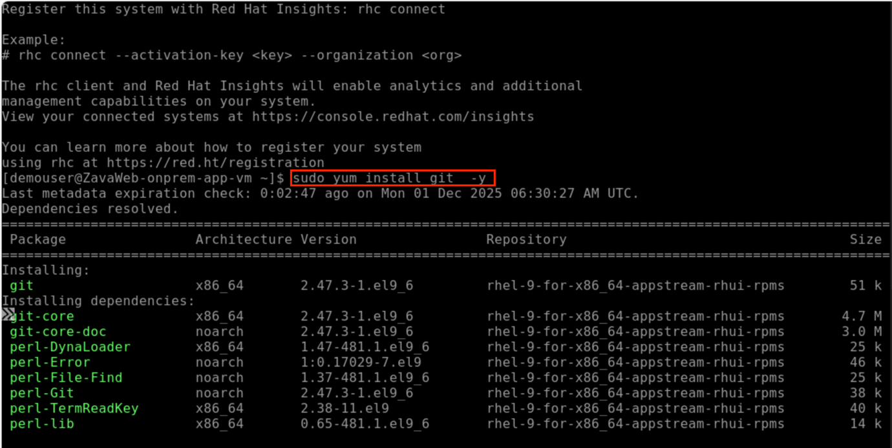

6.  Click Download private key and create a resource.

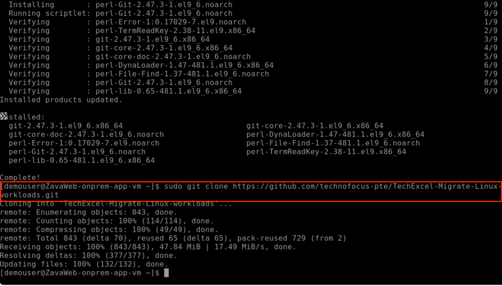

7.  Your deployment has started. Wait for 5-10 mins to complete.

Your VM has been deployed successfully.

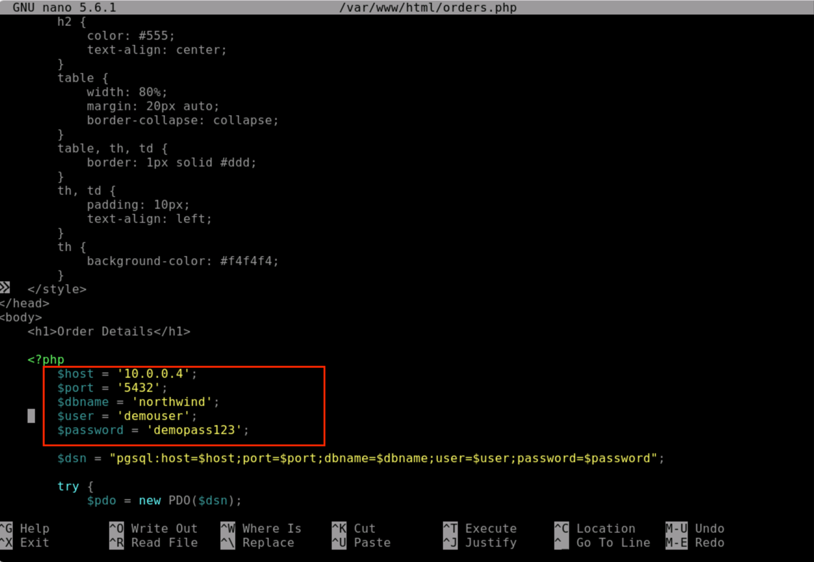

8.  Now click Go to resource

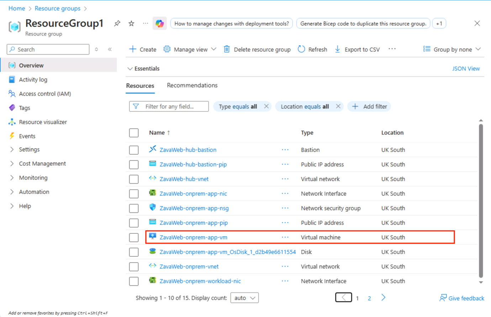

9.  Locate and save the public IP of your VM in Notepad. You will use it
    in the next steps for the connection.

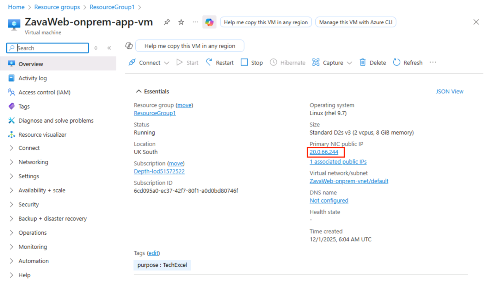

10. Now you will set up SSH. Open **PowerShell** as administrator and
    run the following command to check if the .ssh folder exists in your
    system.

+++dir $HOME\\ssh+++

If you get an error like this, that means this folder is not available.

11. Run the following command to create the .ssh folder in the home
    directory.

+++mkdir $HOME\\ssh+++

It will provide the directory location where it creates the .ssh file.
So save this location.

**Note:** This location may vary for every VM.

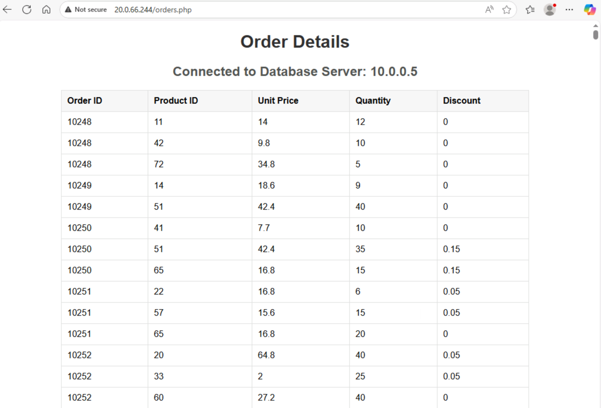

12. Locate your downloaded **“.pem file**” in the File Explorer and copy
    it.

13. Paste it into the given directory. The path will look like this:

C:\Users\Student

So the actual path will look like this:

C:\Users\Student\\ssh\oraclelinux-key.pem

14. Navigate back to the PowerShell and run the following command to
    know the current user:

+++ whoami+++

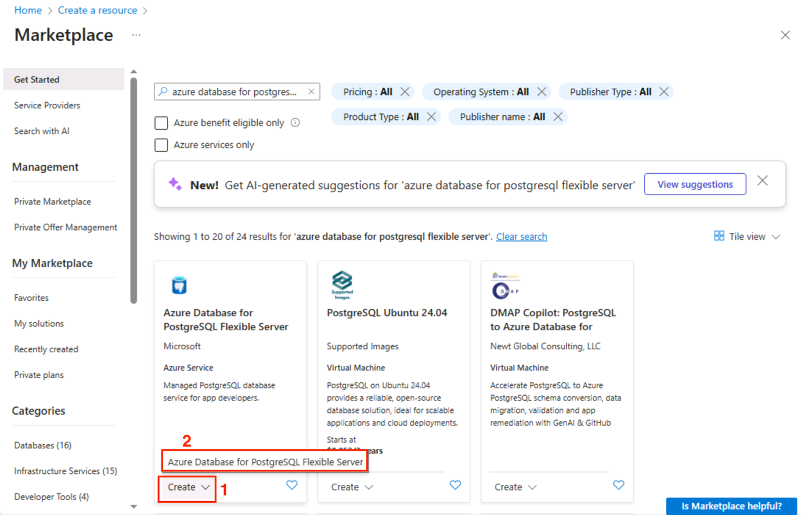

15. Set the permission for .ssh file.

+++icacls "$HOME\\ssh\oracleVirtual_key.pem" /inheritance:r+++

+++ icacls $HOME\\ssh\oracleVirtual_key.pem /grant "\<CURRENT
USER\>:R"+++

**Note:** Get the current user value from the previous step.

For example:

+++ icacls $HOME\\ssh\oracleVirtual_key.pem /grant
"sea-dev\student:R"+++

16. Run the following command to connect to your VM:

+++ssh -i "$HOME\\ssh\oracleVirtual_key.pem"
azureuser@\<VM_PUBLIC_IP\>+++

For Example:

+++ssh -i "$HOME\\ssh\oracleVirtual_key.pem" azureuser@20.83.43.16+++

When you first connect with your VM, it will prompt: “Are you sure you
want to continue connecting (yes/no)?”, the you have to enter +++yes+++

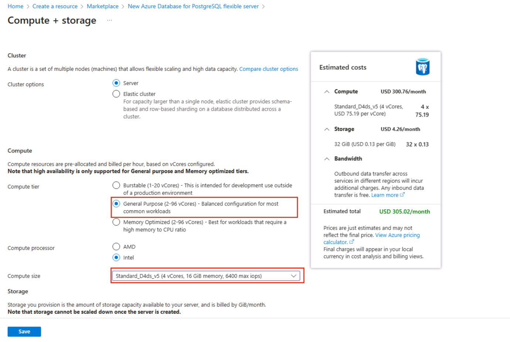

Now you are successfully connected to the VM.

17. Exit from the VM using the following command:

+++exit+++

## Task 3: Setup the Oracle Environment

1.  Open a web browser and navigate to +++
    https://www.oracle.com/database/technologies/xe-downloads.html?utm_source=chatgpt.com+++
    and download : Oracle Database 21c Express edition for Linus
    x64(OL8)+++ and download **Oracle Database 21c Express edition for
    Linus x64(OL8)**

> 

2.  Navigate to the PowerShell and upload this .rmp file to the VM using
    the following command:

> +++ scp -i "$HOME\\ssh\oracleVirtual_key.pem"
> "$HOME\Downloads\oracle-database-xe-21c-1.0-1.ol8.x86_64.rpm"
> azureuser@\<Your-VM-IP\>:~/+++
>
> For Example:
>
> +++ scp -i "$HOME\\ssh\oracleVirtual_key.pem"
> "$HOME\Downloads\oracle-database-xe-21c-1.0-1.ol8.x86_64.rpm"
> azureuser@20.83.43.16:~/+++
>
> Wait for some time to download.
>
> 

3.  Connect to the VM using the following command:

> +++ssh -i "$HOME\\ssh\oracleVirtual_key.pem"
> <azureuser@20.83.43.16>+++
>
> 

4.  Run the following command to install pre-requisites for Oracle XE
    21c.

> +++ sudo dnf install -y oracle-database-preinstall-21c+++
>
> 
>
> After completing this you will get successfully message.
>
> 

5.  Now run the following command to install Oracle Database 21c Express
    Edition in the VM.

> +++sudo dnf localinstall -y
> oracle-database-xe-21c-1.0-1.ol8.x86_64.rpm+++
>
> 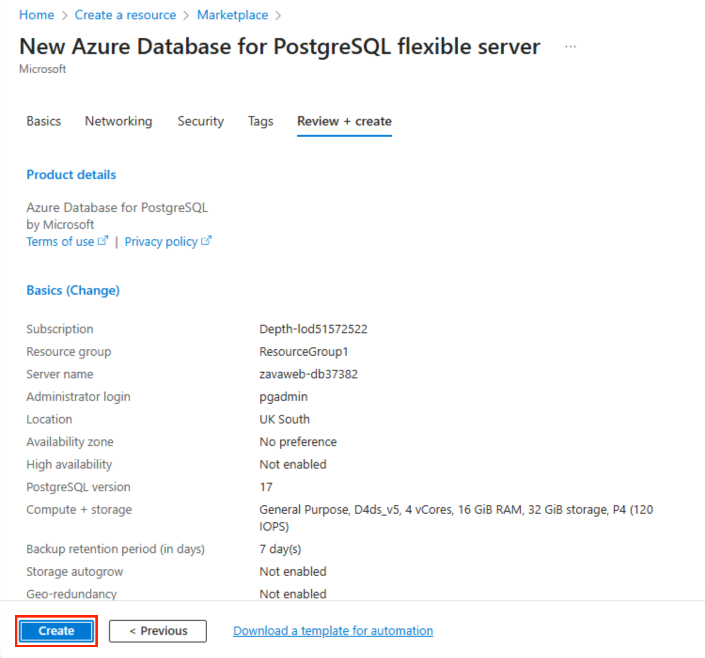

6.  Configure the database:

> +++sudo /etc/init.d/oracle-xe-21c configure+++
>
> It will ask for a password. You can enter this +++p$ssw0rd1289+++
>
> 
>
> Save the pulugged database name that is XEPDB1.
>
> **Note:** It will take 10-15 mins to complete.

7.  Verify the status of Oracle database.

> +++sudo /etc/init.d/oracle-xe-21c status+++
>
> It shows that the database is running, so we have successfully
> installed and configured the Oracle Database 21c Express Edition in
> the VM.
>
> 

8.  Confirm the path where SQLPlus is installed. Oracle Database 21c
    Express Edition comes with SQLPlus and the Instant Client, so we do
    not need to install them separately.

> +++sudo find / -name sqlplus 2\>/dev/null+++
>
> 

9.  Add SQL\*Plus to PATH permanently.

> +++echo 'export ORACLE_HOME=/opt/oracle/product/21c/dbhomeXE' \>\>
> ~/.bashrc+++
>
> +++ echo 'export ORACLE_SID=XE' \>\> ~/.bashrc+++
>
> +++echo 'export PATH=$ORACLE_HOME/bin:$PATH' \>\> ~/.bashrc+++
>
> echo 'export ORACLE_SID=XE' \>\> ~/.bashrc
>
> +++source ~/.bashrc+++
>
> 

10. Verify that the SQL plus is set successfully.

> +++sqlplus -v+++
>
> 

## Task 4: Create a Database in Oracle.

1.  Connect to the Pluggable Database (PDB) as SYSDBA. This logs you in
    with full administrative privileges required for database
    configuration and migration tasks.

> +++sqlplus 'sys/p$ssw0rd1289' as sysdba+++
>
> 

2.  Switched to the pluggable database. This command changes your
    session from the CDB to the target PDB so you can run operations
    inside the PDB.

> +++ALTER SESSION SET CONTAINER=XEPDB1;+++
>
> 

3.  Create the ERP user and grant the required privileges. It creates a
    new application user inside the PDB and assigns the permissions
    needed to create and manage database objects.

> -- Create a new user
>
> CREATE USER zava_erp IDENTIFIED BY Zava1234
>
> DEFAULT TABLESPACE USERS
>
> TEMPORARY TABLESPACE TEMP;
>
> -- Grant privileges
>
> GRANT CONNECT, RESOURCE, CREATE TABLE, CREATE VIEW, CREATE SEQUENCE TO
> zava_erp;
>
> -- Give unlimited quota on USERS tablespace
>
> ALTER USER zava_erp QUOTA UNLIMITED ON USERS;
>
> ALTER PLUGGABLE DATABASE XEPDB1 SAVE STATE;
>
> 

4.  Run +++exit+++ to exit.

> 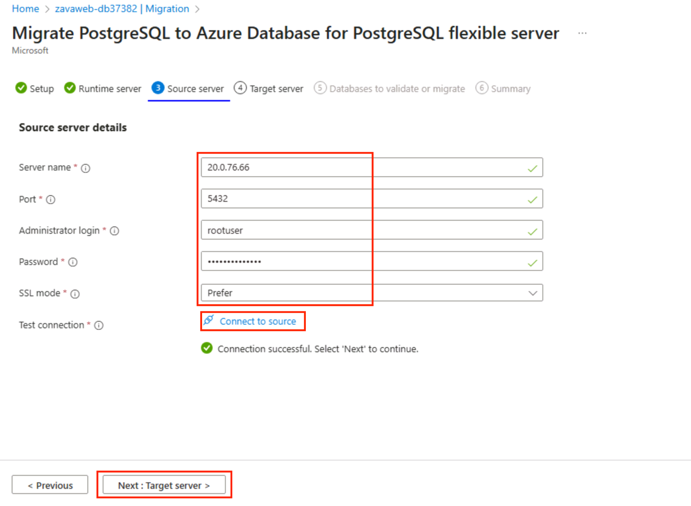

5.  Connect as the new ERP user.

> +++sqlplus zava_erp/Zava1234@localhost:1521/XEPDB1+++
>
> 

6.  Create tables and insert sample data.

> -- Create tables
>
> CREATE TABLE customers (
>
> customer_id NUMBER PRIMARY KEY,
>
> first_name VARCHAR2(50),
>
> last_name VARCHAR2(50),
>
> email VARCHAR2(100)
>
> );
>
> CREATE TABLE orders (
>
> order_id NUMBER PRIMARY KEY,
>
> customer_id NUMBER REFERENCES customers(customer_id),
>
> order_date DATE,
>
> amount NUMBER(10,2)
>
> );
>
> -- Insert sample data
>
> INSERT INTO customers VALUES (1, 'John', 'Doe',
> 'john.doe@example.com');
>
> INSERT INTO customers VALUES (2, 'Jane', 'Smith',
> 'jane.smith@example.com');
>
> INSERT INTO orders VALUES (1001, 1, SYSDATE, 250.75);
>
> INSERT INTO orders VALUES (1002, 2, SYSDATE, 120.50);
>
> COMMIT;
>
> -- Verify data
>
> SELECT \* FROM customers;
>
> SELECT \* FROM orders;
>
> 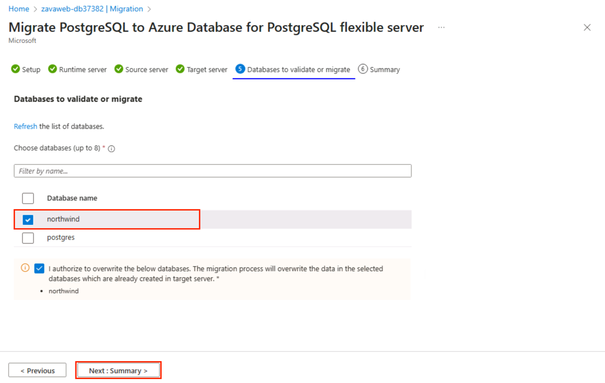

7.  Verify the orders table.

> +++SELECT \* FROM orders;+++
>
> 

8.  Check constraints and table structure.

> +++DESCRIBE customers;+++
>
> +++DESCRIBE orders;+++
>
> And exit from the current console using +++exit+++.
>
> 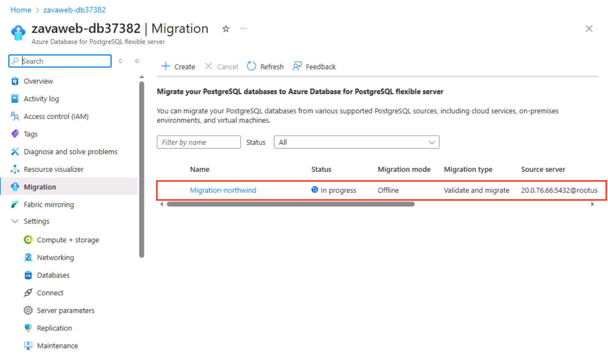

## Task 5: Install and Set Up the Ora2pg tool

1.  Install perl using the following command.

> +++sudo dnf install -y perl perl-core perl-devel+++
>
> 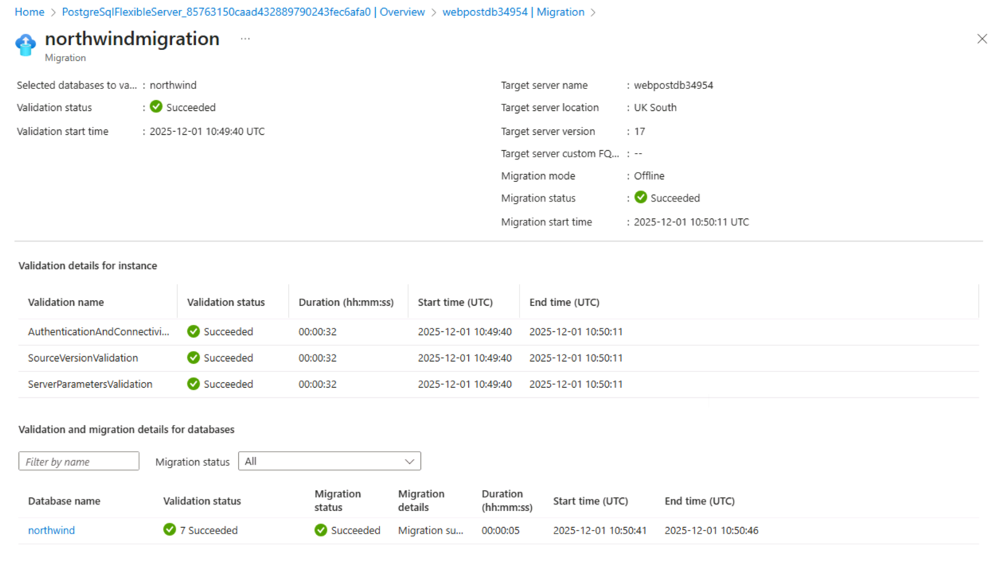

2.  Verify the perl version.

> perl -v
>
> 

3.  Install required Perl dependencies for Ora2PgL:

> +++sudo dnf install -y perl perl-DBI perl-DBD-Pg gcc make+++
>
> 

4.  Now switch to root environment.

> +++sudo -i+++

5.  Set environment variables for root:

> +++export ORACLE_HOME=/opt/oracle/product/21c/dbhomeXE+++
>
> +++export LD_LIBRARY_PATH=$ORACLE_HOME/lib:$LD_LIBRARY_PATH+++
>
> +++export PATH=$ORACLE_HOME/bin:$PATH+++
>
> +++perl -V \# optional: confirm ORACLE_HOME/bin is in PATH+++
>
> 

6.  Verify the value of the environment that you have set in the
    previous step: +++echo $ORACLE_HOME+++

> +++echo $LD_LIBRARY_PATH+++
>
> +++echo $PATH+++
>
> 

7.  Install libaio and libaio-devel libraries

> +++ sudo dnf install -y libaio libaio-devel+++
>
> +++sudo dnf install -y gcc make+++

8.  Verify the installed libraries.

> +++ls /usr/lib64/libaio\*+++
>
> 

9.  Launch CPAN

> +++cpan+++
>
> 

10. Install DBD::Oracle using the following command in CPAN:

> +++force install DBD::Oracle+++
>
> 

11. Exit from CPAN using the following command:

> +++exit+++
>
> 

12. Verify DBD.

> +++perl -MDBD::Oracle -e 'print $DBD::Oracle::VERSION."\n";'+++
>
> 

13. Navigate back to the azureuser directory.

> +++su - azureuser +++
>
> 

14. Download Ora2Pg using the following command.

> +++wget https://github.com/darold/ora2pg/archive/master.zip+++
>
> 

15. Unzip the mazter.zip file.

> +++unzip master.zip+++
>
> 

16. Change the directory

> +++cd ora2pg-master+++
>
> 

17. Run the following commands to install Ora2pg:

> +++perl Makefile.PL+++
>
> +++make+++
>
> +++sudo make install+++
>
> 

18. Verify your Ora2pg using the following command:

> +++ora2pg -v+++

19. Change the directory.

> +++cd ~+++

20. Copy the config file to your home directory:

> +++cp /etc/ora2pg/ora2pg.conf.dist ora2pg.conf+++

21. Edit the congif file

> +++nano ora2pg.conf+++

22. Configure Oracle connection

> ORACLE_DSN dbi:Oracle:host=localhost;port-1521;service_name=XEPDB1
>
> ORACLE_USER zava_erp
>
> ORACLE_PWD Zava1234
>
> After setting up these values, press **Ctrl+X-\>Y-\>Enter**.

23. Run the following command to set environment variables:

> +++echo 'export ORACLE_HOME=/opt/oracle/product/21c/dbhomeXE' \>\>
> ~/.bashrc+++
>
> +++echo 'export LD_LIBRARY_PATH=$ORACLE_HOME/lib' \>\> ~/.bashrc+++
>
> +++echo 'export PATH=$ORACLE_HOME/bin:$PATH' \>\> ~/.bashrc+++
>
> +++source ~/.bashrc+++

24. Verify Oracle client files exist.

> +++ls $ORACLE_HOME/lib | grep libclntsh+++

25. Add Oracle lib path to ldconfig

> +++sudo sh -c 'echo /opt/oracle/product/21c/dbhomeXE/lib \>
> /etc/ld.so.conf.d/oracle.conf'+++
>
> +++sudo ldconfig+++

26. Test DBD::Oracle connection.

> +++perl -MDBD::Oracle -e 'print $DBD::Oracle::VERSION'+++

27. Run the assessment to get to know the cost of the migration.

> +++ora2pg -t SHOW_REPORT -c ~/ora2pg.conf+++

28. Switch to root with environment preserved: sudo -i

29. Set environment variables for root:

> sudo su -
>
> export ORACLE_HOME=/opt/oracle/product/21c/dbhomeXE
>
> export LD_LIBRARY_PATH=$ORACLE_HOME/lib:$LD_LIBRARY_PATH
>
> export PATH=$ORACLE_HOME/bin:$PATH
>
> perl -V \# optional: confirm ORACLE_HOME/bin is in PATH

30. Verify: echo $ORACLE_HOME

> echo $LD_LIBRARY_PATH
>
> echo $PATH

31. Install libaio and libaio-devel

> sudo dnf install -y libaio libaio-devel
>
> sudo dnf install -y gcc make

32. Verify libraries:

> ls /usr/lib64/libaio\*

33. Launch CPAN as Root: cpan

34. Install DBD::Oracle: run command in Cpan: force install DBD::Oracle

35. Verify CPAN: exit and run : perl -MDBD::Oracle -e 'print
    $DBD::Oracle::VERSION."\n";'

36. +++su – azureuser+++ move back to azureuser directory

37. Run migration assessment (cost + complexity) — this is very
    important. Run:

> ora2pg -t SHOW_REPORT -c /home/azureuser/ora2pg-24.3/ora2pg.conf

nano
